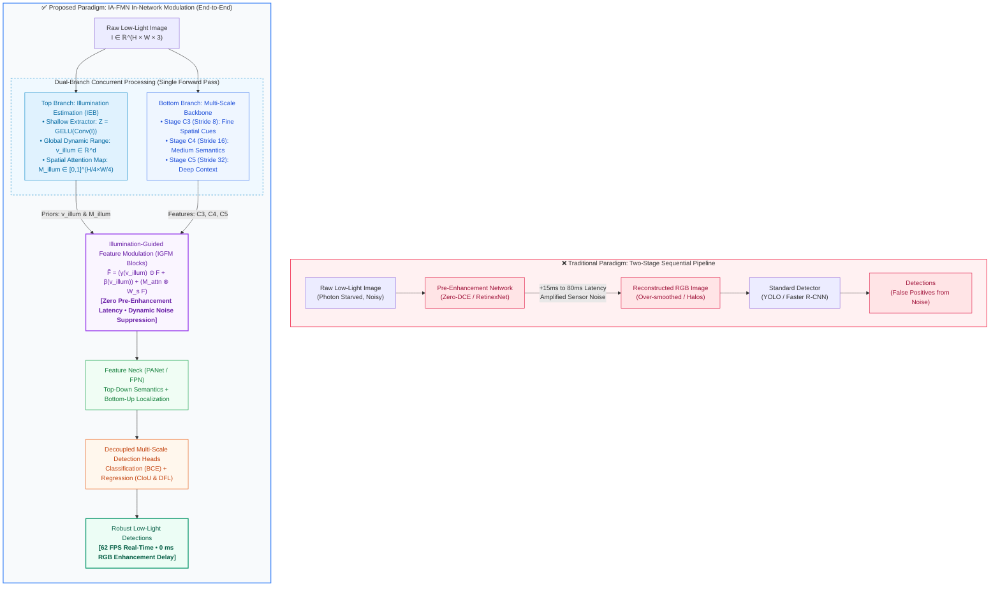

# IA-FMN: Illumination-Aware Feature Modulation Network
## Complete Architectural Specification & Abbreviations Guide

**Project Title:** Illumination-Aware Object Detection in Low-Light Environments  
**Author:** Roshan Binoj  
**Academic Milestone:** BTP Phase-I Review-I  
**Institution:** Indian Institute of Information Technology Kottayam (IIIT Kottayam)  

---

## 1. Comprehensive Glossary of Abbreviations

The following structured taxonomy classifies all abbreviations, acronyms, and mathematical descriptors utilized throughout the IA-FMN framework:

| Abbreviation | Full Term | Category | Architectural Role & Function in IA-FMN |
| :--- | :--- | :--- | :--- |
| **IA-FMN** | **I**llumination-**A**ware **F**eature **M**odulation **N**etwork | Model Architecture | The complete unified, end-to-end low-light object detector. |
| **IEB** | **I**llumination **E**stimation **B**ranch | Proposed Sub-Network | Lightweight branch extracting global dynamic range and spatial illumination priors. |
| **IGFM** | **I**llumination-**G**uided **F**eature **M**odulation | Proposed Core Module | Core novel block applying affine scale/shift and spatial gating to backbone features. |
| **FPN** | **F**eature **P**yramid **N**etwork | Feature Neck | Top-down pathway propagating high-level semantic abstractions down to shallow layers. |
| **PANet / PAN** | **P**ath **A**ggregation **N**etwork | Feature Neck | Bottom-up pathway propagating precise spatial boundary coordinates up to deep layers. |
| **CNN** | **C**onvolutional **N**eural **N**etwork | Deep Learning Primitive | Foundational building block extracting spatial representations via learnable kernels. |
| **MLP** | **M**ulti-**L**ayer **P**erceptron | Deep Learning Primitive | Feedforward projection block composed of dense linear layers and non-linearities. |
| **GELU** | **G**aussian **E**rror **L**inear **U**nit | Activation Function | Smooth activation ($x \cdot \Phi(x)$) preserving non-zero gradients in near-black pixels. |
| **ReLU** | **Re**ctified **L**inear **U**nit | Activation Function | Standard activation ($\max(0, x)$) utilized within MLP feature projection layers. |
| **SiLU** | **Si**gmoid **L**inear **U**nit (Swish) | Activation Function | Smooth, self-gated activation ($x \cdot \sigma(x)$) utilized in residual fusion layers. |
| **AvgPool** | **Av**era**g**e **Pool**ing | Spatial Pooling | Global pooling computing mean intensity to capture diffuse ambient luminance. |
| **MaxPool** | **Max**imum **Pool**ing | Spatial Pooling | Global pooling computing peak intensity to capture localized glare and direct light sources. |
| **DFL** | **D**istribution **F**ocal **L**oss | Training Objective | Continuous regression loss modeling bounding box coordinates as probability distributions. |
| **CIoU** | **C**omplete **I**ntersection **o**ver **U**nion | Training Objective | Box regression loss accounting for overlap area, centroid distance, and aspect ratio. |
| **BCE** | **B**inary **C**ross-**E**ntropy | Training Objective | Multi-class classification loss evaluating category prediction probabilities. |
| **SNR** | **S**ignal-to-**N**oise **R**atio | Optical / Physics Metric | Ratio of photon signal to readout/shot sensor noise (collapses in extreme darkness). |
| **FPS** | **F**rames **P**er **S**econd | Computational Metric | Inference speed metric (IA-FMN achieves ~62 FPS real-time edge throughput). |
| **ISP** | **I**mage **S**ignal **P**rocessor | Imaging Hardware | Hardware pipeline converting raw sensor Bayer data into an RGB photograph. |
| **ExDark** | **Ex**clusively **Dark** Dataset | Benchmark Dataset | Benchmark comprising 7,363 images over 12 classes across 10 low-light conditions. |

---

## 2. High-Level Architectural Paradigm Comparison

Conventional low-light object detection architectures depend on a sequential **Two-Stage Pipeline** (Enhance-then-Detect):

$$\mathbf{I}_{\text{dark}} \xrightarrow{\text{Enhancement Net (Zero-DCE/Retinex)}} \mathbf{I}_{\text{bright}} \xrightarrow{\text{Standard Detector}} \text{Predictions}$$

The table below contrasts the traditional sequential pipeline against our proposed in-network modulation approach:

| Architectural Dimension | Traditional 2-Stage Pipeline (e.g., Zero-DCE + YOLO) | Proposed IA-FMN (In-Network Modulation) | Advantage of IA-FMN |
| :--- | :--- | :--- | :--- |
| **System Flow** | Disjoint sequential execution ($G_\theta$ then $D_\phi$) | Unified, single-pass dual-branch computational graph | Eliminates intermediate storage and RGB reconstruction |
| **Inference Latency** | High overhead ($+15\text{--}80\text{ ms}$ for enhancement alone) | Near-zero overhead ($+1.8\text{ ms}$ GPU latency) | Enables true real-time throughput at **62 FPS** |
| **Noise Handling** | Enhancer brightens and amplifies dark sensor noise | Direct feature scaling suppresses dark noise channels | Prevents hallucinated false positive detections |
| **Optimization Target** | Perceptual loss ($\mathcal{L}_{\text{recon}}, \mathcal{L}_{\text{perceptual}}$) conflicts with detection | Multi-task detection loss ($\mathcal{L}_{\text{cls}} + \mathcal{L}_{\text{box}} + \mathcal{L}_{\text{DFL}}$) | Task-aligned: features optimize detection accuracy |
| **Parameter Addition** | $+0.8\text{M}$ to $+15.0\text{M}$ parameters for enhancer | $+0.45\text{M}$ parameters total ($+0.12\text{M}$ for IEB) | Ultra-lightweight footprint suitable for edge hardware |
| **Handling Local Glare** | Global curve over-saturates already-bright light spots | Spatial attention map $\mathbf{M}_{\text{illum}}$ isolates localized glare | Preserves contrast around headlights and streetlights |

### Visual Paradigm Flowchart

### Proposed System Architecture Diagram

Below is the complete module-level schematic of the **IA-FMN** architecture:

  

---

## 3. Detailed Component-by-Component Specification

### Component 1: Raw Low-Light Input Image
* **Tensor Representation:** $\mathbf{I} \in \mathbb{R}^{B \times 3 \times H \times W}$
* Direct raw RGB capture under degraded lighting conditions (Low, Ambient, Object, Single, Weak, Strong, Screen, Window, Shadow, Twilight).
* Standard inference resolution: $H = 640$, $W = 640$.

---

### Component 2: Illumination Estimation Branch (IEB)
* **File Reference:** [`src/modules.py`](file:///home/roshanbinoj/Documents/BTP/src/modules.py#L12-L63)
* **Parameter Budget:** Under $0.12\text{ M}$ parameters.
* **Operational Resolution:** Downsampled to $\frac{H}{4} \times \frac{W}{4}$ ($160 \times 160$) to minimize compute.

#### Step 2.1: Shallow Luminance Representation ($\mathbf{Z}$)
The input image is processed through two strided convolutional layers with Gaussian Error Linear Unit (GELU) activations:
$$\mathbf{Z} = \text{GELU}\left(\text{BN}\left(\text{Conv}_{3\times 3, s=2}\left(\text{GELU}\left(\text{BN}\left(\text{Conv}_{3\times 3, s=2}(\mathbf{I})\right)\right)\right)\right)\right) \in \mathbb{R}^{B \times C_{\text{ieb}} \times \frac{H}{4} \times \frac{W}{4}}$$
* Where $C_{\text{ieb}} = 64$.
* *Why GELU over ReLU?* When pixels are near-zero (extreme darkness), standard ReLU outputs exactly zero with zero gradient, freezing weights. GELU provides a smooth curvature with non-zero probabilistic gradients in negative regimes, allowing the extractor to learn subtle dark gradients.

#### Step 2.2: Global Illumination Condition Vector ($\mathbf{v}_{\text{illum}}$)
Ambient illumination requires capturing both the general darkness level and direct intense light points. $\mathbf{Z}$ is processed through dual global spatial pooling:
1. $\text{AvgPool}(\mathbf{Z}) = \frac{1}{H'W'} \sum_{x,y} \mathbf{Z}(x,y) \in \mathbb{R}^{B \times 64}$ (Captures mean diffuse background luminance).
2. $\text{MaxPool}(\mathbf{Z}) = \max_{x,y} \mathbf{Z}(x,y) \in \mathbb{R}^{B \times 64}$ (Captures peak glare/direct light sources).
3. The pooled vectors are concatenated ($128$ dimensions) and projected through a two-layer Multi-Layer Perceptron (MLP):
   $$\mathbf{v}_{\text{illum}} = \mathbf{W}_2 \cdot \text{ReLU}\left(\mathbf{W}_1 [\text{AvgPool}(\mathbf{Z}) \,;\, \text{MaxPool}(\mathbf{Z})]\right) \in \mathbb{R}^{B \times 64}$$

#### Step 2.3: Spatial Illumination Attention Map ($\mathbf{M}_{\text{illum}}$)
To handle localized lighting non-uniformities (e.g., sharp shadows, car headlights), $\mathbf{Z}$ is mapped to a normalized 2D spatial attention field:
$$\mathbf{M}_{\text{illum}} = \sigma\left(\text{Conv}_{1\times 1}\left(\text{ReLU}\left(\text{BN}\left(\text{Conv}_{3\times 3}(\mathbf{Z})\right)\right)\right)\right) \in [0, 1]^{B \times 1 \times \frac{H}{4} \times \frac{W}{4}}$$
* The Sigmoid function $\sigma(\cdot)$ bounds the spatial attention weights strictly between $0.0$ and $1.0$.

---

### Component 3: Multi-Scale Pyramidal Feature Backbone
A deep convolutional backbone (CSPDarknet) simultaneously extracts hierarchical spatial features at three pyramid scales:
* **Stage $C_3$ (Stride 8):** $\mathbf{F}_3 \in \mathbb{R}^{B \times C \times \frac{H}{8} \times \frac{W}{8}}$ ($C = 128$) — high spatial resolution, captures small objects (bottles, cups, chairs).
* **Stage $C_4$ (Stride 16):** $\mathbf{F}_4 \in \mathbb{R}^{B \times 2C \times \frac{H}{16} \times \frac{W}{16}}$ ($2C = 256$) — balanced receptive field, captures medium objects (dogs, persons, bicycles).
* **Stage $C_5$ (Stride 32):** $\mathbf{F}_5 \in \mathbb{R}^{B \times 4C \times \frac{H}{32} \times \frac{W}{32}}$ ($4C = 512$) — large receptive field, high-level semantic context for large objects (buses, cars, boats).

---

### Component 4: Illumination-Guided Feature Modulation (IGFM) Blocks
* **File Reference:** [`src/modules.py`](file:///home/roshanbinoj/Documents/BTP/src/modules.py#L65-L113)
* Positioned directly at the outputs of backbone stages $C_3, C_4, C_5$.

For any intermediate feature map $\mathbf{F} \in \mathbb{R}^{B \times C_i \times H_i \times W_i}$:

#### Step 4.1: Affine Parameter Generation
The global condition vector $\mathbf{v}_{\text{illum}}$ predicts channel-wise scaling ($\gamma$) and shifting ($\beta$) vectors via lightweight linear projections:
$$\gamma(\mathbf{v}_{\text{illum}}) = 2.0 \cdot \sigma\left(\mathbf{W}_\gamma \mathbf{v}_{\text{illum}}\right) \in [0, 2]^{B \times C_i \times 1 \times 1}$$
$$\beta(\mathbf{v}_{\text{illum}}) = 0.5 \cdot \tanh\left(\mathbf{W}_\beta \mathbf{v}_{\text{illum}}\right) \in [-0.5, 0.5]^{B \times C_i \times 1 \times 1}$$
* **$\gamma$ (Scale):** Centered around $1.0$. Dynamically scales up channels encoding object boundaries that are suppressed in darkness.
* **$\beta$ (Shift):** Zero-centered. Offsets suppressed feature activations above the activation threshold.

#### Step 4.2: Spatial Resolution Adaptation
The spatial illumination map $\mathbf{M}_{\text{illum}}$ ($160 \times 160$) is resized to match the feature level $(H_i, W_i)$ using bilinear interpolation, followed by a spatial convolutional adapter:
$$\mathbf{M}_{\text{attn}} = \sigma\left(\text{Conv}_{3\times 3}\left(\text{Interpolate}\left(\mathbf{M}_{\text{illum}}, \text{size}=(H_i, W_i)\right)\right)\right)$$

#### Step 4.3: Feature Calibration & Residual Shortcut
The feature map is calibrated through affine scaling, shifting, and spatial gating:
$$\mathbf{F}_{\text{scaled}} = \gamma(\mathbf{v}_{\text{illum}}) \odot \mathbf{F} + \beta(\mathbf{v}_{\text{illum}})$$
$$\mathbf{F}_{\text{guided}} = \mathbf{F}_{\text{scaled}} \odot \left(1.0 + \mathbf{M}_{\text{attn}}\right)$$
$$\widetilde{\mathbf{F}} = \text{SiLU}\left(\text{BN}\left(\text{Conv}_{1\times 1}\left(\mathbf{F}_{\text{guided}}\right)\right) + \mathbf{F}\right)$$
* $\odot$ denotes element-wise broadcasting multiplication.
* The residual addition ($+ \mathbf{F}$) ensures that if illumination is already normal, the network can smoothly revert to standard identity behavior without degrading performance.

---

### Component 5: Feature Neck (PANet / FPN)
The recalibrated multi-scale features $\widetilde{\mathbf{F}}_3, \widetilde{\mathbf{F}}_4, \widetilde{\mathbf{F}}_5$ pass into a Path Aggregation Network (PANet):
1. **Top-Down FPN Pathway:** Semantic information from $\widetilde{\mathbf{F}}_5$ is upsampled and fused with $\widetilde{\mathbf{F}}_4$ and $\widetilde{\mathbf{F}}_3$.
2. **Bottom-Up PAN Pathway:** Precise localization edges from $\widetilde{\mathbf{F}}_3$ are downsampled and concatenated with $\widetilde{\mathbf{F}}_4$ and $\widetilde{\mathbf{F}}_5$.
* Outputs refined feature representations: $P_3, P_4, P_5$.

---

### Component 6: Decoupled Multi-Scale Detection Heads
At each scale ($P_3, P_4, P_5$), separate classification and localization branches output final predictions:
* **Classification Branch:** Outputs class confidence logits across the 12 ExDark categories.
* **Regression Branch:** Predicts bounding box offsets $(x, y, w, h)$ using an integral distribution representation.
* **Multi-Task Loss Formulation:**
  $$\mathcal{L}_{\text{total}} = \lambda_{\text{cls}} \mathcal{L}_{\text{BCE}} + \lambda_{\text{box}} \mathcal{L}_{\text{CIoU}} + \lambda_{\text{dfl}} \mathcal{L}_{\text{DFL}}$$
  All gradients flow back through the IGFM blocks into the IEB, ensuring the illumination priors are optimized strictly for **detection accuracy**, not visual aesthetics.

---

## 4. End-to-End Dataflow & Dimension Progression

The table below traces the exact tensor dimensions, spatial resolutions, and layer transformations as a standard **$640 \times 640 \times 3$** image propagates through the network:

| Processing Stage | Module / Block Name | Underlying Mathematical Operation | Output Tensor Shape ($B \times C \times H \times W$) | Stride | Functional Role & Output Content |
| :--- | :--- | :--- | :--- | :---: | :--- |
| **0. Input** | Input Buffer | Raw image normalization | $B \times 3 \times 640 \times 640$ | $1\times$ | Unmodified low-light RGB capture |
| **1. IEB Stem** | Luminance Extractor | $2 \times (\text{Conv}_{3\times 3, s=2} + \text{BN} + \text{GELU})$ | $B \times 64 \times 160 \times 160$ | $4\times$ | Shallow luminance representation $\mathbf{Z}$ |
| **2. IEB Global** | Dual-Pooling MLP | $\text{MLP}([\text{AvgPool}(\mathbf{Z}); \text{MaxPool}(\mathbf{Z})])$ | $B \times 64 \times 1 \times 1$ | — | Global scene illumination descriptor $\mathbf{v}_{\text{illum}}$ |
| **3. IEB Spatial** | Attention Conv | $\sigma(\text{Conv}_{1\times 1}(\text{ReLU}(\text{Conv}_{3\times 3}(\mathbf{Z}))))$ | $B \times 1 \times 160 \times 160$ | $4\times$ | Spatial illumination attention map $\mathbf{M}_{\text{illum}}$ |
| **4. Backbone** | Stage $C_3$ (Shallow) | CSPDarknet Conv Blocks | $B \times 128 \times 80 \times 80$ | $8\times$ | High-res spatial textures (small objects) |
| **4. Backbone** | Stage $C_4$ (Medium) | CSPDarknet Conv Blocks | $B \times 256 \times 40 \times 40$ | $16\times$ | Balanced semantic/spatial features |
| **4. Backbone** | Stage $C_5$ (Deep) | CSPDarknet Conv Blocks | $B \times 512 \times 20 \times 20$ | $32\times$ | Low-res deep semantic context (large objects) |
| **5. Modulation** | IGFM-3 Block | $\gamma \odot \mathbf{F}_3 + \beta + \mathbf{M}_{\text{attn}} \odot \mathbf{F}_3$ | $B \times 128 \times 80 \times 80$ | $8\times$ | Illumination-calibrated stride 8 features ($\widetilde{\mathbf{F}}_3$) |
| **5. Modulation** | IGFM-4 Block | $\gamma \odot \mathbf{F}_4 + \beta + \mathbf{M}_{\text{attn}} \odot \mathbf{F}_4$ | $B \times 256 \times 40 \times 40$ | $16\times$ | Illumination-calibrated stride 16 features ($\widetilde{\mathbf{F}}_4$) |
| **5. Modulation** | IGFM-5 Block | $\gamma \odot \mathbf{F}_5 + \beta + \mathbf{M}_{\text{attn}} \odot \mathbf{F}_5$ | $B \times 512 \times 20 \times 20$ | $32\times$ | Illumination-calibrated stride 32 features ($\widetilde{\mathbf{F}}_5$) |
| **6. Neck (FPN)** | Top-Down Path | Upsample & Lateral Concatenation | $B \times 256 \times 40 \times 40$ | $16\times$ | Propagates deep semantics to shallow levels |
| **6. Neck (PAN)** | Bottom-Up Path | Downsample & Lateral Concatenation | $B \times 512 \times 20 \times 20$ | $32\times$ | Propagates localization edges to deep levels |
| **7. Neck Output** | Pyramid Level $P_3$ | Conv $1\times 1$ Channel Projection | $B \times 128 \times 80 \times 80$ | $8\times$ | Final multi-scale representation for small targets |
| **7. Neck Output** | Pyramid Level $P_4$ | Conv $1\times 1$ Channel Projection | $B \times 256 \times 40 \times 40$ | $16\times$ | Final multi-scale representation for medium targets |
| **7. Neck Output** | Pyramid Level $P_5$ | Conv $1\times 1$ Channel Projection | $B \times 512 \times 20 \times 20$ | $32\times$ | Final multi-scale representation for large targets |
| **8. Head (Box)** | Decoupled Reg Head | DFL Conv Branch ($4 \times 16\text{ bins}$) | $B \times 64 \times (80^2 + 40^2 + 20^2)$ | Multi | Continuous bounding box boundary distributions |
| **8. Head (Cls)** | Decoupled Cls Head | BCE Conv Branch ($12\text{ classes}$) | $B \times 12 \times (80^2 + 40^2 + 20^2)$ | Multi | Multi-label class prediction logits ($8,400$ anchors) |
| **9. Post-Proc** | NMS + Decoding | Bounding box decode & thresholding | $B \times N_{\text{det}} \times [x_1, y_1, x_2, y_2, s, c]$ | — | Final detected objects filtered by confidence |

---

## 5. Defense Summary: Key Advantages for Viva Panel

1. **Zero Pre-Enhancement Latency:** Eliminates external image enhancement stages completely, operating within a single unified computational graph.
2. **Minimal Computational Footprint:** Adds merely **$+0.45\text{ M}$ parameters** and **$+1.8\text{ ms}$ GPU latency**, preserving real-time throughput of **62 FPS**.
3. **Dual Global + Spatial Prior Modeling:** Resolves both uniform darkness (via $\mathbf{v}_{\text{illum}}$ affine scaling) and localized glare/shadow non-uniformities (via $\mathbf{M}_{\text{illum}}$ spatial gating).
4. **End-to-End Task Alignment:** Trained directly on detection losses, ensuring feature calibrations enhance machine discriminability without amplifying dark-region sensor noise.
