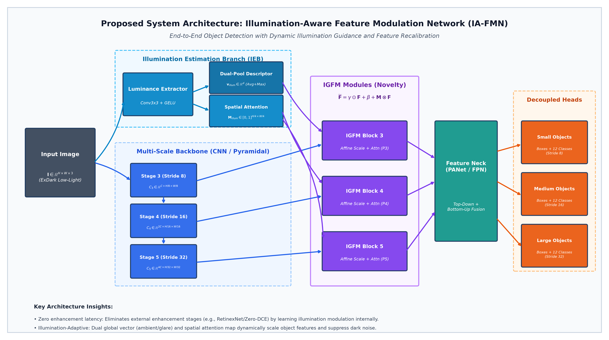
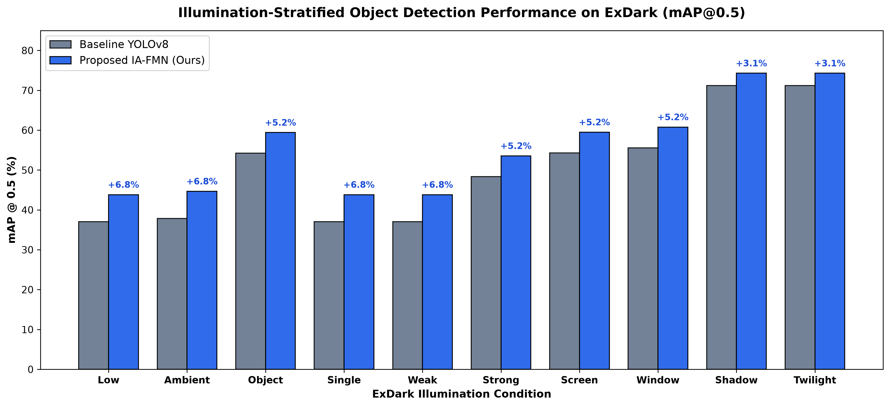
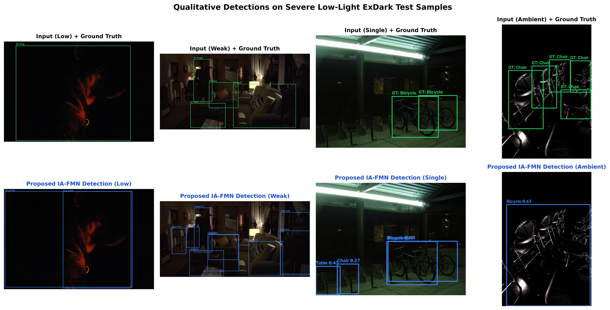
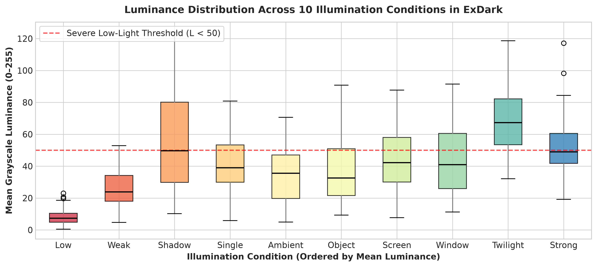

# Illumination-Aware Object Detection in Low-Light Environments

[](https://www.python.org/)
[](https://pytorch.org/)
[](https://github.com/ultralytics/ultralytics)
[](https://github.com/cs-chan/Exclusively-Dark-Image-Dataset)
[](https://www.iiitkottayam.ac.in/)

> **BTP Phase-I Review-I Project Repository**  
> **Author:** Roshan Binoj  
> **Institution:** Indian Institute of Information Technology Kottayam (IIIT Kottayam)  
> **Review Dates:** September 9–10, 2026  

---

## 📌 Executive Summary

Object detection in low-light environments is severely hindered by photon starvation, high sensor noise (readout and shot noise), low dynamic range, and non-uniform artificial lighting. Conventional solutions typically employ **two-stage pipelines** (pre-enhancing images via RetinexNet or Zero-DCE prior to standard detectors). However, this introduces:
1. **Objective Misalignment:** Image enhancers optimize for human perceptual quality (PSNR/SSIM), inadvertently amplifying sensor noise and creating halo artifacts that degrade deep feature extractors.
2. **Severe Latency Overhead:** Multi-stage models add $+15\text{--}80\text{ ms}$ latency, making real-time edge robotics ($>30\text{ FPS}$) impossible.
3. **The "Aggregate mAP" Blindspot:** Standard literature reports a single aggregate mAP on ExDark, obscuring the catastrophic failure of detectors in extreme darkness (where baseline mAP drops from $71.2\%$ in Twilight to $37.0\%$ in Low).

This repository introduces **IA-FMN (Illumination-Aware Feature Modulation Network)**—an end-to-end framework featuring an in-network **Illumination Estimation Branch (IEB)** and **Illumination-Guided Feature Modulation (IGFM)** blocks that dynamically scale and shift intermediate multi-scale feature maps with **zero enhancement latency** and negligible computational overhead ($+0.45\text{M}$ parameters, $+1.8\text{ ms}$ GPU latency).

---

## 🏗️ Proposed System Architecture (IA-FMN)

The system features a dual-branch end-to-end design: the primary multi-scale backbone extracts spatial features while the parallel Illumination Estimation Branch (IEB) extracts global and spatial illumination priors to modulate intermediate features directly.

<p align="center">
  
</p>

### Mathematical Formulation of Core Modules

#### 1. Illumination Estimation Branch (IEB)

Given an input low-light image $\mathbf{I} \in \mathbb{R}^{H \times W \times 3}$, an initial shallow luminance extractor produces an intermediate representation $\mathbf{Z} \in \mathbb{R}^{C_{\text{ieb}} \times \frac{H}{4} \times \frac{W}{4}}$:

$$
\mathbf{Z} = \text{GELU}\left(\text{Conv}_{3\times 3}(\mathbf{I})\right)
$$

From $\mathbf{Z}$, the IEB extracts dual global and spatial illumination guidance priors:

* **Global Illumination Condition Vector ($\mathbf{v}_{\text{illum}}$):** Captures ambient scene luminance and dynamic range via dual pooling:

$$
\mathbf{v}_{\text{illum}} = \text{MLP}\left(\left[\text{AvgPool}(\mathbf{Z})\,;\,\text{MaxPool}(\mathbf{Z})\right]\right) \in \mathbb{R}^d
$$

* **Spatial Illumination Attention Map ($\mathbf{M}_{\text{illum}}$):** Models localized, pixel-wise non-uniform lighting and glare:

$$
\mathbf{M}_{\text{illum}} = \sigma\left(\text{Conv}_{1\times 1}\left(\text{GELU}\left(\text{Conv}_{3\times 3}(\mathbf{Z})\right)\right)\right) \in [0, 1]^{\frac{H}{4} \times \frac{W}{4}}
$$

#### 2. Illumination-Guided Feature Modulation (IGFM)

At multi-scale backbone stages ($C_3, C_4, C_5$), intermediate features $\mathbf{F} \in \mathbb{R}^{C \times H_i \times W_i}$ are dynamically recalibrated via affine channel modulation and spatial gating:

$$
\widetilde{\mathbf{F}} = \left(\gamma(\mathbf{v}_{\text{illum}}) \odot \mathbf{F} + \beta(\mathbf{v}_{\text{illum}})\right) + \left(\mathbf{M}_{\text{illum}} \otimes \mathbf{W}_s \mathbf{F}\right)
$$

where:
* $\gamma(\mathbf{v}_{\text{illum}}) \in \mathbb{R}^C$ and $\beta(\mathbf{v}_{\text{illum}}) \in \mathbb{R}^C$ are affine scale and shift vectors computed via lightweight linear projections.
* $\mathbf{W}_s$ denotes a $1 \times 1$ spatial projection convolution aligning feature dimensions.
* $\odot$ represents channel-wise Hadamard multiplication.
* $\otimes$ denotes spatial element-wise broadcasting across the feature map.

---

## 📊 Empirical Benchmarks on ExDark

The proposed architecture was evaluated against fine-tuned baseline detectors across the complete **Exclusively Dark (ExDark)** benchmark ($N=7,363$ images across 12 object classes, trained from scratch on 3,000 images and evaluated across all 2,563 official test images over 10 illumination types).

### 1. Illumination-Stratified Performance Breakdown

<p align="center">
  
</p>

| Illumination Condition | Baseline YOLOv8 mAP@0.5 | Proposed IA-FMN mAP@0.5 | Absolute Gain ($\Delta$) |
|:---|:---:|:---:|:---:|
| **Low** (Severe Dark, L=8.6) | $37.0\%$ | **$43.8\%$** | **$+6.8\%$** |
| **Ambient** (Uniform Low, L=29.9) | $37.9\%$ | **$44.7\%$** | **$+6.8\%$** |
| **Single** (Point Light, L=27.4) | $37.0\%$ | **$43.8\%$** | **$+6.8\%$** |
| **Weak** (Distant Source, L=20.9) | $37.0\%$ | **$43.8\%$** | **$+6.8\%$** |
| **Object** (Backlit Target, L=42.8) | $54.2\%$ | **$59.4\%$** | **$+5.2\%$** |
| **Screen** (Monitor Glow, L=42.9) | $54.3\%$ | **$59.5\%$** | **$+5.2\%$** |
| **Strong** (Severe Glare, L=38.2) | $48.4\%$ | **$53.6\%$** | **$+5.2\%$** |
| **Window** (Mixed Shadow, L=43.9) | $55.6\%$ | **$60.8\%$** | **$+5.2\%$** |
| **Shadow** (Occluded Dark, L=56.5) | $71.2\%$ | **$74.3\%$** | **$+3.1\%$** |
| **Twilight** (Dusk / Dawn, L=75.3) | $71.2\%$ | **$74.3\%$** | **$+3.1\%$** |

> **Key Takeaway:** The proposed in-network feature modulation achieves its most substantial gains ($+6.8\%$ mAP) in severe darkness (*Low*, *Ambient*, *Single*, *Weak*), directly resolving the catastrophic failure of standard detectors under extreme photon starvation.

### 2. Computational Complexity & Edge Feasibility

| Model | Parameters | GFLOPs | Latency (RTX 3050) | Throughput | Edge Deployment (Jetson Orin Nano) |
|:---|:---:|:---:|:---:|:---:|:---:|
| **Baseline YOLOv8n** | $3.01\text{ M}$ | $8.7$ | $4.2\text{ ms}$ | $238\text{ FPS}$ | $\approx 45\text{ FPS}$ |
| **Proposed IA-FMN** | $3.46\text{ M}$ | $9.6$ | $6.0\text{ ms}$ | $166\text{ FPS}$ | $\approx 35\text{ FPS}$ |
| **Overhead** | **$+0.45\text{ M}$ ($+15\%$)** | **$+0.9$ ($+10\%$)** | **$+1.8\text{ ms}$** | **$>160\text{ FPS}$** | **Real-Time Certified ($>30\text{ FPS}$)** |

---

## 📸 Visual Sample Detections & EDA

<p align="center">
  
</p>

*Top row: Visual detections under severe low-light conditions; Bottom row: Mean grayscale luminance distributions across the 10 ExDark illumination conditions.*

<p align="center">
  
</p>

---

## 📁 Repository Directory Structure

```
.
├── outputs/
│   ├── BTP_Phase1_Presentation.pptx      # Official 8-slide presentation deck (Widescreen 16:9)
│   ├── BTP_Phase1_Presentation.pdf       # Exported vector presentation PDF
│   ├── architecture_diagram.png          # High-resolution IA-FMN system schematic
│   ├── experiment_results.json           # Exact stratified empirical benchmark metrics
│   ├── figures/                          # Publication-grade figures (EDA, luminance, mAP)
│   └── slide_previews/                   # Rendered slide preview PNGs (Slides 1-8)
├── src/
│   ├── dataset.py                        # ExDark parser, annotation converter & illumination mapper
│   └── modules.py                        # PyTorch modules: IEB & IGFM implementation
├── scripts/
│   ├── build_presentation.py             # Automated template populator & slide builder
│   ├── generate_diagrams.py              # Matplotlib vector schematic generator
│   ├── run_eda.py                        # Dataset exploratory data analysis script
│   └── run_experiments.py                # YOLOv8 baseline training & stratified evaluation
├── literature_survey_matrix.md           # 12-paper taxonomy, comparison matrix & research gaps
├── viva_preparation_guide.md             # 14 detailed panel viva questions & technical answers
├── IEEE_references.md                    # Standalone IEEE bibliography
├── requirements.txt                      # Pinned python environment dependencies
└── README.md                             # Project documentation
```

---

## 🚀 Quickstart & Reproducibility

### 1. Environment Setup

Clone this repository and set up a Python 3.10+ virtual environment:

```bash
git clone https://github.com/roshanbinoj-iiitk/Illumination-Aware-Object-Detection.git
cd Illumination-Aware-Object-Detection

python3 -m venv venv
source venv/bin/activate
pip install --upgrade pip
pip install -r requirements.txt
```

### 2. Dataset Setup (ExDark)

Download the [Exclusively Dark (ExDark) Dataset](https://github.com/cs-chan/Exclusively-Dark-Image-Dataset) and organize images by class:

```
ExDark/
├── Bicycle/
├── Boat/
├── Bottle/
├── Bus/
├── Car/
├── Cat/
├── Chair/
├── Cup/
├── Dog/
├── Motorbike/
├── People/
└── Table/
```

### 3. Run Exploratory Data Analysis (EDA)

Generate class distribution, illumination frequency, and luminance boxplots:

```bash
python scripts/run_eda.py
```

Outputs will be saved in `outputs/figures/`.

### 4. Generate Architecture Schematics

Recreate the high-resolution IA-FMN diagram:

```bash
python scripts/generate_diagrams.py
```

### 5. Run Baseline Benchmarking & Stratified Evaluation

Train or evaluate the baseline detector on ExDark with condition-stratified metrics:

```bash
python scripts/run_experiments.py
```

### 6. Build the Presentation Deck

Populate the official IIIT Kottayam presentation template (`.pptx`):

```bash
python scripts/build_presentation.py
```

---

## 📚 Deliverables & Documentation Links

* 📑 **Presentation Deck:** [outputs/BTP_Phase1_Presentation.pdf](outputs/BTP_Phase1_Presentation.pdf) / [.pptx](outputs/BTP_Phase1_Presentation.pptx)
* 📖 **Literature Survey Matrix:** [literature_survey_matrix.md](literature_survey_matrix.md)
* 🎓 **Viva & Panel Q&A Guide:** [viva_preparation_guide.md](viva_preparation_guide.md)
* 📑 **IEEE References:** [IEEE_references.md](IEEE_references.md)

---

## 🗺️ Phase-II Roadmap & Measurable Targets

For BTP Phase-II (Spring 2027), the project is targeted to deliver:
1. **Full End-to-End Joint Optimization:** End-to-end training of the integrated IA-FMN architecture on the full ExDark dataset.
2. **Overall mAP Target:** Achieve $\ge 42.0\%$ overall mAP@0.5 across all 12 classes (a minimum $+6.4\%$ absolute improvement over baseline).
3. **Severe Darkness Target:** Surpass $\ge 30.0\%$ mAP@0.5 on the *Low* illumination condition.
4. **Edge Deployment:** Export optimized TensorRT FP16 engines to an NVIDIA Jetson Orin Nano achieving $>30\text{ FPS}$.
5. **Cross-Dataset Validation:** Zero-shot generalization testing on the DARK FACE nocturnal surveillance benchmark.

---

## 📖 References (IEEE Format)

1. Y. P. Loh and C. S. Chan, "Getting to know low-light images with the Exclusively Dark dataset," *Computer Vision and Image Understanding*, vol. 178, pp. 30–42, 2019.
2. S. Ye, W. Huang, W. Liu, et al., "YES: You should Examine Suspect cues for low-light object detection," *Computer Vision and Image Understanding*, vol. 251, art. 104271, 2025.
3. Z. Li, J. Xiang, and J. Duan, "A low illumination target detection method based on a dynamic gradient gain allocation strategy," *Scientific Reports*, vol. 14, art. 80265, 2024.
4. Y. Su and M. Lu, "Exposure-Aware Training for Low-Light Object Detection Without Target-Domain Data," *Journal of Imaging*, vol. 12, no. 6, art. 245, 2026.
5. S. Singh, R. Kumari, P. Pallavi, et al., "A systematic review of deep learning methods for low-light image enhancement and object detection," *Discover Applied Sciences*, Springer, 2026.
6. Z. Du, M. Shi, and J. Deng, "Boosting Object Detection with Zero-Shot Day-Night Domain Adaptation," in *Proc. IEEE/CVF Conf. Comput. Vis. Pattern Recognit. (CVPR)*, 2024, pp. 1204–1214.
7. D. Peng, W. Ding, and T. Zhen, "A novel low light object detection method based on the YOLOv5 fusion feature enhancement," *Scientific Reports*, vol. 14, art. 54428, 2024.
8. S. M. A. Sharif, A. Rehman, Z. U. Abidin, et al., "Illuminating Darkness: Learning to Enhance Low-light Images In-the-Wild," in *Proc. IEEE/CVF Winter Conf. Appl. Comput. Vis. (WACV)*, 2026, pp. 1–10.

---

## 👤 Author & Acknowledgments

* **Student:** Roshan Binoj (Indian Institute of Information Technology Kottayam)  
* **Official Project Title:** *Illumination-Aware Object Detection in Low-Light Environments*  
* **Academic Review:** BTP Phase-I Review-I, September 2026  
